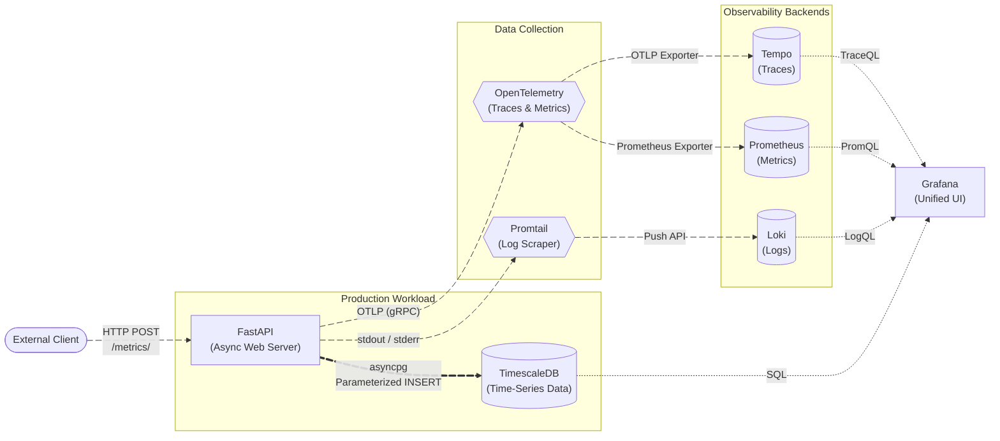

# FastAPI Observability Stack

[](https://github.com/rehansxcbom/fastapi-observability/actions/workflows/ci.yml)

This repository provides a containerized FastAPI application fully instrumented with OpenTelemetry to automatically generate and export telemetry data. It includes a pre-configured Docker orchestration setup to route this data into a modern observability backend.


## System Architecture

The stack implements the core pillars of observability:
* **FastAPI:** The primary Python application, utilizing zero-code instrumentation via the OpenTelemetry SDK to track requests without manual code changes.
* **Tempo:** A distributed tracing system that receives and stores the generated trace spans via the OTLP gRPC protocol.
* **Prometheus:** An open-source monitoring toolkit configured to scrape and store time-series metrics from the FastAPI service.
* **Loki & Promtail:** Promtail acts as a local agent that automatically discovers and scrapes Docker container logs (such as Uvicorn output) and pushes them to Loki, a highly scalable log aggregation system.
* **FastAPI & SQLModel:** Asynchronous web framework leveraging `asyncpg` for high-throughput non-blocking database queries and Pydantic for strict input validation.
* **TimescaleDB:** A PostgreSQL extension optimized for time-series metrics, configured with composite primary keys (`time` + `server_id`) to prevent insertion collisions.
* **OpenTelemetry:** Zero-code auto-instrumentation for tracing and metrics, routed centrally via the **OpenTelemetry Collector**.
* **Grafana:** A unified visualization platform to query traces in Tempo, explore container logs in Loki, and build metric dashboards from Prometheus.
* **Container Security:** Multi-stage builds utilizing isolated Python virtual environments (`/opt/venv`) and healthchecks.


## Prerequisites

Ensure Docker and Docker Compose are installed on your local machine.


## System Flow





## Services & Ports

| Service | Port | Description |
|---|---|---|
| **FastAPI** | `8000` | Asynchronous core Python web API. |
| **Grafana** | `3000` | Unified UI for dashboards, metrics, and traces. |
| **Prometheus** | `9090` | Time-series database UI for performance counters. |
| **Tempo** | `3200` | Distributed tracing backend UI. |
| **OTel Collector** | `4317` | Central OTLP telemetry receiver (gRPC). |
| **Loki** | `3100` | Log aggregation database. |
| **TimescaleDB** | `5432` | PostgreSQL time-series storage backend. |


## Security & Secrets Management

This project enforces a **diskless secrets management** policy. Database credentials are never stored in static `.env` files or committed to source control. Instead, they are dynamically injected into the Docker environment directly from your terminal session via the `Makefile`. All endpoints interacting with the database utilize parameterized ORM queries to eliminate SQL injection vulnerabilities.


## Getting Started

1. **Launch the Stack:**
   Run the interactive Makefile command. It will prompt you to securely supply a database password while validating input to ensure it is not empty.

```bash
make up
```

2. **Ingest Time-Series Metrics:**
  Use K6 to create 50 virtual users and 1m20s max duration (up to 50 looping VUs for 50s over 3 stages gracefulRampDown: 30s, gracefulStop: 30s)

```bash
make load-test
```

3. **Explore Observability:**
   Open `http://127.0.0.1:3000` (Grafana) to explore your persistent dashboards, query application logs via Loki, and inspect query latency via Tempo traces.


## Operational Makefile Commands

Run `make help` to view all available commands. Key workflows include:

*   **Factory Reset (Wipe Volumes & Containers):** `make reset`
*   **Run Local Checks (Linting, Formatting, & Testing):** `make check`
*   **Watch Live Logs:** `make logs`


## Testing & Dependency Injection

The test suite uses FastAPI's native **Dependency Injection** (`app.dependency_overrides`) combined with `unittest.mock.AsyncMock`. This allows the test suite to execute locally in milliseconds without requiring an active TimescaleDB container instance, enabling true offline testing. Code formatting and linting are strictly enforced via Ruff.
