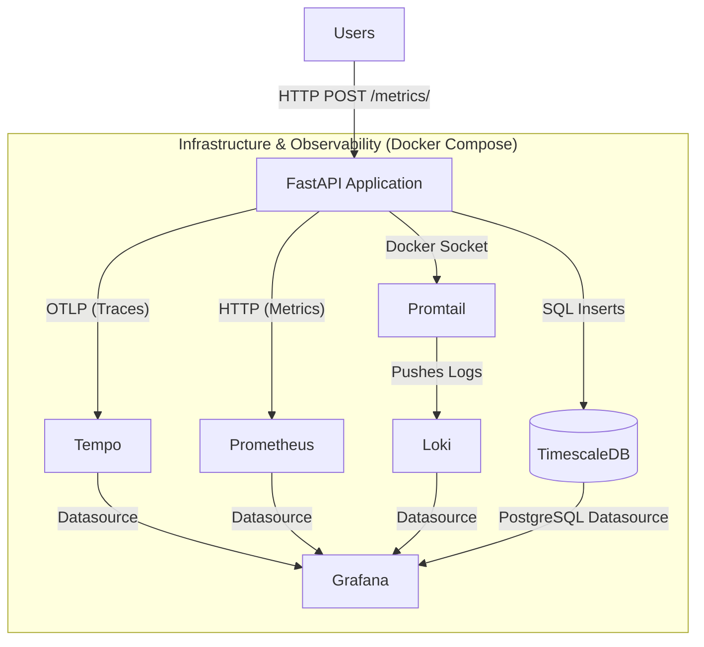

# FastAPI Observability Stack

[](https://github.com/rehansxcbom/fastapi-observability/actions/workflows/ci.yml)

This repository provides a containerized FastAPI application fully instrumented with OpenTelemetry to automatically generate and export telemetry data. It includes a pre-configured Docker orchestration setup to route this data into a modern observability backend.

## System Architecture

The stack implements the core pillars of observability:
* **FastAPI:** The primary Python application, utilizing zero-code instrumentation via the OpenTelemetry SDK to track requests without manual code changes.
* **Tempo:** A distributed tracing system that receives and stores the generated trace spans via the OTLP gRPC protocol.
* **Prometheus:** An open-source monitoring toolkit configured to scrape and store time-series metrics from the FastAPI service.
* **Loki & Promtail:** Promtail acts as a local agent that automatically discovers and scrapes Docker container logs (such as Uvicorn output) and pushes them to Loki, a highly scalable log aggregation system.
* **Grafana:** A unified visualization platform to query traces in Tempo, explore container logs in Loki, and build metric dashboards from Prometheus.

## Prerequisites

Ensure Docker and Docker Compose are installed on your local machine.

## Architecture

This project utilizes Grafana, Loki, Tempo, Prometheus and OpenTelemetry to provide full, zero-code end user instrumentation and observability.


## Services & Ports

| Service         | Port   | Description                                          |
| --------------- | ------ | ---------------------------------------------------- |
| **FastAPI**     | `8000` | The core Python web application.                     |
| **Grafana**     | `3000` | Unified UI for viewing dashboards and querying data. |
| **Prometheus**  | `9090` | Time-series database UI for metrics.                 |
| **Tempo**       | `3200` | Distributed tracing backend (receives on `4317`).    |
| **Loki**        | `3100` | Log aggregation system.                              |
| **TimescaleDB** | `5432` | PostgreSQL time-series database.                     |

## Getting Started

1. **Launch the Stack:**
    Use the Makefile to launch the stack interactively (it will prompt you to securely type a database password):
```bash
	make up
```
Alternatively, for automation/CI pipelines, pass the password as a parameter:
```bash
	make up DB_PASS=your_secure_password_here
```


2. **Generate Time-Series Data:** 
	Fire off a POST request to ingest data into TimescaleDB. OpenTelemetry will automatically trace the HTTP request and the SQL `INSERT` statement.
	```bash
	 curl -X POST http://127.0.0.1:8000/metrics/ \
     -H "Content-Type: application/json" \
     -d '{"server_id": "api-node-02", "cpu_utilization": 88.5}'
	```
	
3. **Visualize Data (Grafana):** 
	Navigate to `http://127.0.0.1:3000`. Here you can configure PostgreSQL as a data source to graph your time-series data, and explore Tempo to see exactly how many milliseconds the SQL query took to execute.
	

## Local Development & Testing

This project uses `pytest` for automated testing and `ruff` for code formatting, enforced via GitHub Actions.

The test suite utilizes `unittest.mock` to intercept database connections, meaning you can run the full test suite locally in milliseconds without needing to spin up the TimescaleDB Docker container.
bash 
# Run formatting, linting, and tests via the Makefile 

```bash
make check
```

## Extending the Application (Adding Endpoints)

Because this project uses the `FastAPIInstrumentor`, any new routes you add to the application are automatically instrumented. You do not need to write custom trace or metric code for basic HTTP monitoring.

To add a new endpoint, simply open `main.py` and define your new route above the `FastAPIInstrumentor.instrument_app(app)` line:


```python
@app.get("/items/{item_id}")
def read_item(item_id: int):
    return {"item_id": item_id, "status": "Found"}
```
